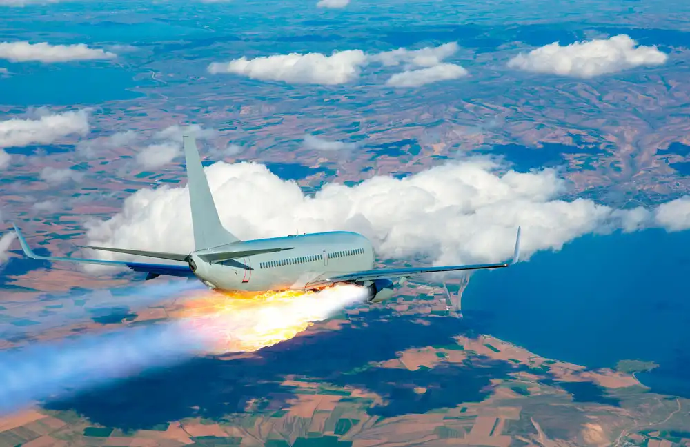
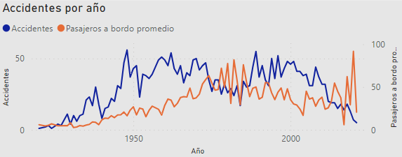
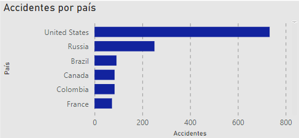
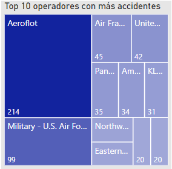
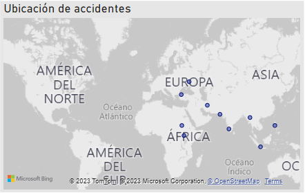

# Análisis de Accidentes Aéreos

## Contexto

Los accidentes aéreos son eventos inesperados e indeseados que involucran aeronaves y se producen daños físicos a personas o a la propia aeronave. Un accidente aéreo puede involucrar cualquier tipo de aeronave, incluyendo aviones comerciales, aviones privados, helicópteros, planeadores y globos aerostáticos.
Los accidentes aéreos pueden ser causados por diversos factores, como errores humanos, fallos de equipos, problemas meteorológicos, problemas de mantenimiento, fallas en la gestión del tráfico aéreo, problemas de diseño o problemas de fabricación. Y en cuanto a sus consecuencias, pueden ser tanto en términos de pérdidas humanas como económicas.
Es por eso que la industria de la aviación, las autoridades reguladoras y los investigadores trabajan incansablemente para mejorar la seguridad de la aviación y prevenir futuros accidentes. Por otro lado, para las organizaciones asociadas a la aviación, estudiar la causalidad de los accidentes y aprender a cómo prevenirlos en el futuro es clave para poder evitar pérdidas humanas y daños materiales significativos.

## Desarrollo del Proyecto

Se inicia con un Data Preprocessing donde evaluamos la cantidad de datos nulos, duplicados y la relevancia de algunas columnas dentro de la problemática a evaluar. Luego se realiza un Exploratory Data Analysis para tener una idea de las proporciones, relaciones y distribuciones que nos podemos encontrar a lo largo del proyecto, analizamos distribución de los accidentes con respecto a la década, usamos gráficos boxplot para evaluar la presencia de outliers y su coherencia e influencia dentro del contexto de los datos y finalmente, se evalúan las correlaciones entre las variables del dataset usando una matriz de correlaciones. Por último, utilizamos Power Bi para realizar visualizaciones interactivas desde distintos enfoques para analizar nuestros datos y poder construir KPIs acordes al contexto.
Finalmente, se utiliza Power BI para crear visualizaciones interactivas que permiten analizar los datos desde distintos enfoques y construir Key Performance Indicators (KPIs) acordes al contexto.

## KPIs (Indicadores Clave de Desempeño)

El proyecto propone evaluar tres KPIs relacionados con la seguridad de la aviación:

1. **Tasa de Fatalidad de la Tripulación**: Evaluar la disminución de un 10% en la tasa de fatalidad de la tripulación en los últimos 10 años, comparado con la década anterior. La fórmula de la tasa de fatalidad es (Suma total de fallecidos en el período de tiempo) / (Suma total de accidentes en el período de tiempo).

2. **Disminución de Muertes por Accidentes Aéreos**: Evaluar la disminución de un 20% en las muertes causadas por accidentes aéreos en la última década, comparado con la década anterior. La fórmula para calcular las muertes por año es (Suma total de fallecidos en el período de tiempo) / (Total de años en el período de tiempo).

3. **Disminución de Accidentes Aéreos por Año**: Evaluar la disminución de un 30% en la cantidad de accidentes aéreos por año en la última década, comparado con la década anterior. La fórmula para calcular los accidentes por año es (Suma total de accidentes en el período de tiempo) / (Total de años en el período de tiempo).

## Análisis

En el análisis de los datos, se destacan varios hallazgos interesantes:

- En el gráfico de líneas donde se visualizan la cantidad de accidentes por año y el número promedio de pasajeros a bordo, podemos apreciar que: primero, la mayoría de accidentes se ubican entre 1947 y 1973 y entre 1988 y 2008. En el primer rango de tiempo el mundo se encontraba en el contexto de la Guerra Fría, por lo que eran muchos los ejercicios militares de las fuerzas aéreas de Estados Unidos y Rusia, también el auge de la aviación comercial alrededor de 1950, ya que se empezaron a realizar viajes transatlánticos y había una gran regulación y seguridad en materia de aviación por lo que los usuarios se sentían más seguros al viajar en avión. En el segundo rango de tiempo, el contexto de la guerra fría no había cambiado por lo que seguían los ejercicios militares, en la década de los 80 hubo una desregularización de la industria de la aviación en varios países, lo que llevó a una mayor competencia y mayor disponibilidad de vuelos comerciales. Ahora, comparando con el promedio de pasajeros por año, se puede apreciar que hubo más accidentes aéreos cuando el número promedio de pasajeros era menor, esto debido a que los aviones más pequeños son más sensibles a las condiciones meteorológicas adversas y a la visibilidad reducida, también cabe destacar que en los primeros años de aviación comercial no se contaba con aviones de gran capacidad de pasajeros.

    

- Se puede evidenciar que Estados Unidos es el país con más accidentes registrados (733) dentro del dataset, seguido de Rusia (251) y Brasil (92), ya que estos han sido parte de los países pioneros en la aviación.

    

- Los dos operadores con más accidentes registrados son Aeroflot y la Fuerza Aérea de EEUU, la primera es una aerolínea rusa, la cual es la más antigua en la historia, por lo que al ser pionera en el negocio de la aviación se vio involucrada en muchos accidentes debidos a fallas mecánicas, errores humanos y falta de tecnología. Es de esperarse que la Fuerza Aérea de EEUU esté en este grupo ya que al realizar ejercicios militares se realizan maniobras riesgosas para la integridad del avión y por consiguiente para la integridad del piloto y sus tripulantes.

    

- Podemos apreciar que en la última década la mayoría de accidentes aéreos han ocurrido en zonas alejadas de occidente como: Pakistán, Indonesia, Rusia, Myanmar, Irán, entre otros. Esto puede ser consecuencia de una baja calidad de infraestructura en materia de aviación debido a que son territorios muy alejados y algunos de estos con conflictos militares por lo que no hay mucha presencia de entidades supervisoras de seguridad.
  
    

## Conclusiones

- Habiendo analizado los datos proporcionados, se puede concluir que en la última década hubo una gran disminución de accidentes aéreos debido a la gran cantidad de avances con respecto a la seguridad aérea, tales como: sistemas de advertencia y prevención de colisiones, entrenamiento y capacitación exhaustiva de la tripulación de vuelo, mejoras en ciberseguridad, mantenimientos preventivos más avanzados para las aeronaves e investigaciones de accidentes aéreos más sofisticadas. Esto último ayuda a comprender de manera más profunda las causas de los accidentes y cómo prevenirlos para garantizar la seguridad de tripulantes y pasajeros.

- A día de hoy las aerolíneas han optado por aeronaves de mayor capacidad, tanto por optimización de costos, emisiones de CO2 como por seguridad, ya que como se analizó previamente, los aviones pequeños son más sensibles a condiciones meteorológicas adversas por lo que tener una aeronave más grande también es una inversión en materia de seguridad.

- Son muchos los desafíos que enfrenta la industria aeronáutica en los territorios alejados de occidente en consecuencia de las difíciles condiciones socioeconómicas, pero debe ser una prioridad para las entidades supervisoras establecer protocolos e infraestructura a la altura de la tecnología y economía actual para garantizar la seguridad de las aeronaves que deben volar por estos territorios.

- En el dashboard se puede apreciar que hay un aumento de la tasa de fatalidad en los últimos 20 años con respecto a los 30 anteriores, esto es consecuencia de que hoy en día las aeronaves son de mayor capacidad por lo que unos pocos accidentes aéreos pueden traducirse en altas pérdidas humanas y por esto una mayor tasa de fatalidad, por lo que este puede no ser un indicador muy adecuado para evaluar la seguridad aérea, ya que son muchos los avances tecnológicos en materia de seguridad. De lo cual si se ha registrado una disminución es en la cantidad de accidentes por año y cantidad de muertes por año, lo cual si es muestra de los avances en seguridad.
